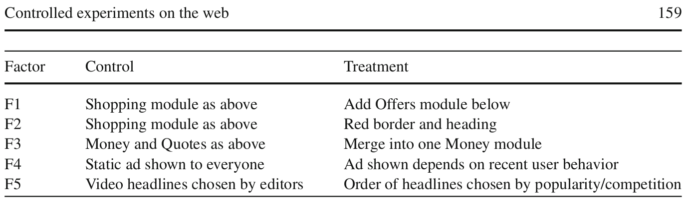

# Controlled experiments on the web: survey and practical guide

> One accurate measurement is worth more than a thousand expert opinions - Admiral Grace Hopper

## Controlled experiments (A/B tests)

1. the Control, which is commonly the “existing” version, and
2. the Treatment, which is usually a new version being evaluated.

Statistical tests are then conducted on the
collected data to evaluate whether there is a statistically significant difference between
the two variants on metrics of interest, thus permitting us to retain or reject the (null)
hypothesis that there is no difference between the versions.

> The fewer the facts, the stronger the opinion– Arnold Glasow
   
> Enlightened trial and error outperforms the planning of flawless execution– David Kelly, founder of Ideo
> To have a great idea, have a lot of them– Thomas A. Edison

## Terminology

1. Overall evaluation criterion (OEC): A quantitative measure of the experiment’s objective. In statistics this is often called the Response or Dependent Variable. Also, called the performance metric.
2. Factor: A controllable experimental variable that is though to influence the OEC.
3. Variant: A user experience being tested by assigning levels to the factor.
4. Experimental unit: The entity over which metrics are calculated before averaging over the entire experiment for each variant. Sometimes called an item. On the web, the user is a common experimental unit, although some metrics may have user-day, user-session or page views as the 
experimental units.
5. Null Hypothesis: The OECs for the variants are not different and that any observed differences during the experiment are due to random fluctuations.
6. Confidence interval: The probability of failing to reject (i.e., retaining) the null hypothesis when it is true.
7. Power: The probability of correctly rejecting the null hypothesis, $H_0$, when it is
false. Power measures our ability to detect a difference when it indeed exists.
8. A/A Test: Sometimes called the NULL Test. An A/A test can be used to (i) collect data and
assess its variability for power calculations, and (ii) test the experimentation system
9. Standard deviation:
10. Standard error: For a statistic, it is the standard deviation of the sampling distribution of the sample statistic. For a mean of n independent random variable it is $\hat{\sigma}/n$ where $\hat{\sigma}$ is the estimated standard deviation.

## Hypothesis testing:

* Confidence interval: Normal set to 95%
* Power: Commonly desired to be around 80%-95%, although not directly controllable. The power
is the probability of determining that the difference is statistically significant
* Standard error: The smaller the std-error, the more powerful the test. 3 ways to reduce the std-error:
  1. Increasing sample size
  2. Use OEC with inherently lower variability
  3. Lower the variability of the OEC by filtering out users who were not exposed
to the variants
* Effect: The difference in OECs for the variants. Larger differences are easier to detect that smaller.

## Formulas:

### t-test:
$t = \frac{\bar{O_A}-\bar{O_B}}{\hat{\sigma_d}}$

Where $\hat{\sigma_d}$ is the estimated standard deviation of the difference between the two OEC's.

### Calculation of sample size
For 95% confidence interval and 80% power:

$n = \frac{16\sigma^2}{\Delta^2}$

## Example

### Example 1
Suppose you have an e-commerce site and 5% of users who visit during the
experiment period end up purchasing. Those purchasing spend about $75. The
average user therefore spends $3.75 (95% spend $0). Assume the standard devia-
tion is $30. If you are running an A/B test and want to detect a 5% change to revenue,
you will need over 409,000 users to achieve the desired 80% power, based on the
above formula: 16 ∗ 30^2 /(3.75 ∗ 0.05)^2.

### Example 2
If, however, you were only looking for a 5% change in conversion rate (not revenue),
a lower variability OEC based on point 3.b can be used. Purchase, a conversion event,
is modeled as a Bernoulli trial with p = 0.05 being the probability of a purchase.
The standard deviation of a Bernoulli is $\sqrt{p(1 − p)}$ and thus you will need less than
122,000 users to achieve the desired power based on 16 ∗ (0.05 · (1 − 0.05))/(0.05 ·
0.05)^2

### Confidence intervals for percent effect
forming a confidence interval around the percent change is not a straightfor-
ward extension of the confidence interval for the absolute effect. This is because we
are now dividing by a random variable.

## Limitations:

* Quantitative metrics, but no explanations: answering "why"
* Short-term vs long-term effects
* Primacy and newness effect
* Feature must be implemented 
* Consistency
* Parallel experiments
* Launch events and media announcements

# MultiVariable testing
An experiment that includes more than one factor is often called a MultiVariable test
(MVT)

# Implementation architecture
1. Randomization algorithm
2. Assignment method
3. Data path

# Lessons learned
> The difference between theory and practice is larger in practice than the differ-
ence between theory and practice in theory– Jan L.A. van de Snepscheut

Run A/A tests (see Sect. 3.1) and validate the following.
1. Are users split according to the planned percentages?
2. Is the data collected matching the system of record?
3. Are the results showing non-significant results 95% of the time?
Continuously run A/A tests in parallel with other experiments.

# Summary

Classical knowledge discovery and data mining provide insight, but the patterns
discovered are correlational and therefore pose challenges in separating useful action-
able patterns from those caused by “leaks” (Kohavi et al. 2004). Controlled experi-
ments neutralize confounding variables by distributing them equally over all values
through random assignment (Keppel et al. 1992), thus establishing a causal relation-
ship between the changes made in the different variants and the measure(s) of interest,
including the Overall Evaluation Criterion (OEC).