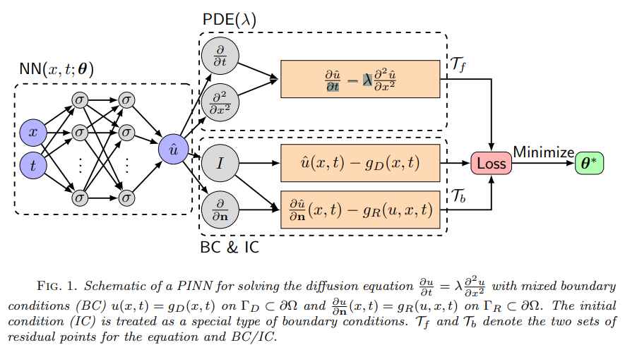
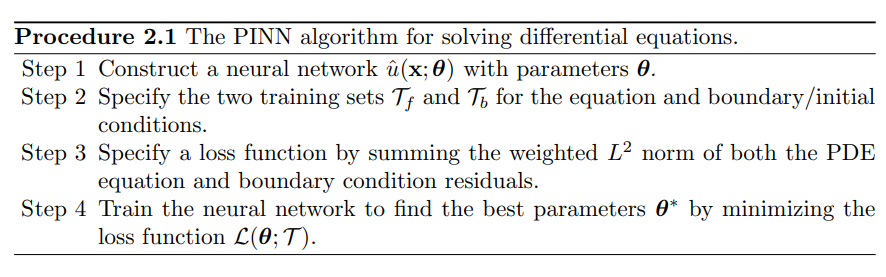
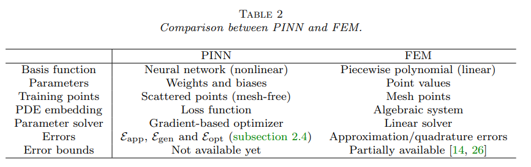
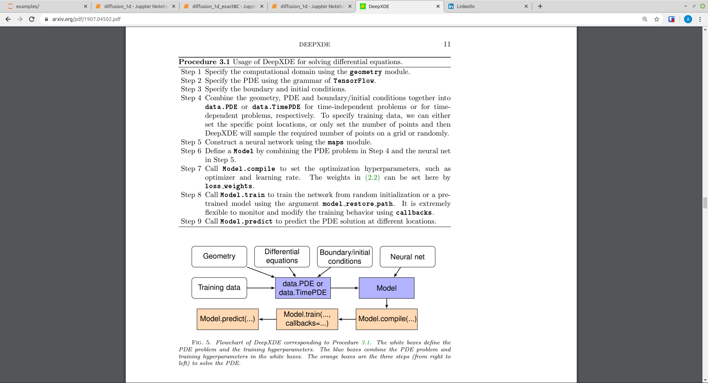

# DEEPXDE: A DEEP LEARNING LIBRARY FOR SOLVING DIFFERENTIAL EQUATIONS

[Link to paper](https://arxiv.org/pdf/1907.04502.pdf)

Subfield: Scientific Machine Learning (SciML)

Key idea: Replace traditional numerical discretization methods with a neural network that approximates the solution to a PDE.

Deep learning could be a mesh-free approach by taking advantage of the automatic differentiation, and could break the curse of dimensionality.

## Convergence
We remark that based on our experience, for smooth PDE solutions L-BFGS can find a good solution with less iterations than Adam, because L-BFGS uses secondorder derivatives of the loss function, while Adam only relies on first-order derivatives.

## Uniqueness
Unlike traditional numerical methods, for PINNs there is no guarantee of unique solutions, because PINN solutions are obtained by solving non-convex optimization problems, which in general do not have a unique solution. 

## Network size

The required network size depends highly on the smoothness of the PDE solution. For example, a small network (e.g.a few layers and twenty neurons per layer) is sufficient for solving the 1D Poisson
equation, but a deeper and wider network is required for the 1D Burgers equation to achieve a similar level of accuracy

## PINN vs FEM

## DeepXDE

## Conclusions:

### Pros
* Unlike numerical differentiation, automatic differentiation does not differentiate the data and hence it can tolerate noisy data for training.

## PINN disadvantages

* PINNs are currently slower than finite elements but this can be
alleviated via offline training.

* Another limitation is the search for effective neural network architectures, which is currently done empirically by users; however, emerging meta-learning techniques can be used to automate this search.